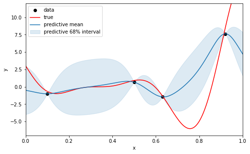
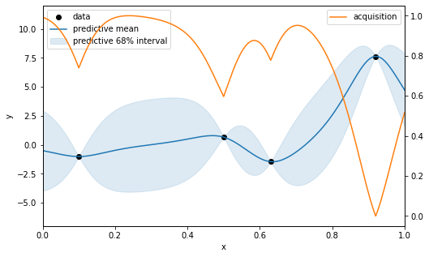
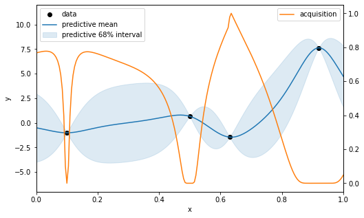
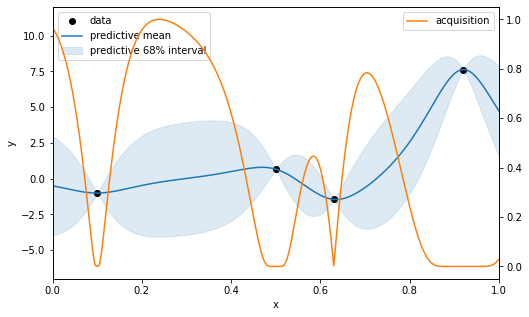
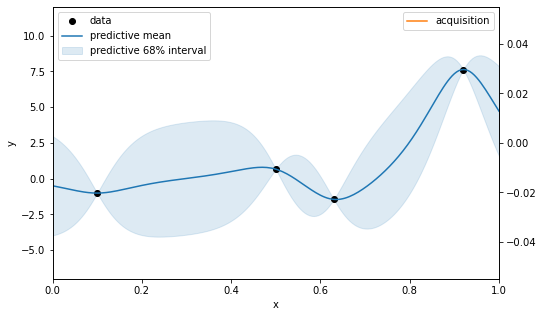
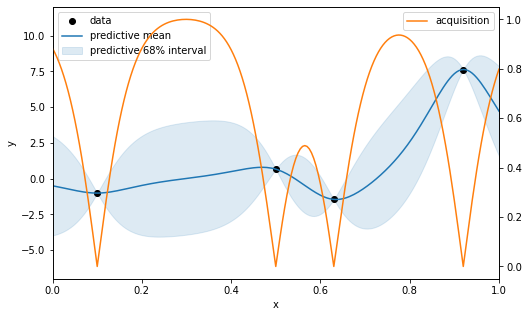
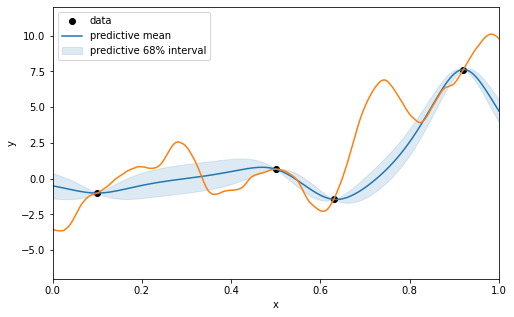

# Single-objective acquisition functions

In Bayesian optimization the acquisition $\alpha(x)$ quantifies how useful a point $x$ is towards finding the minimum $y^* = \min_{x \in \mathcal{X}} f(x)$ of some black-box function $f$.
Hence, we want to maximize the acquisition function at each step $t=1 ... T$.  
$D_t = \{(x_1, y_1) ... (x_t, y_t)\}$ is the data, of which $x^+$ is the location of the best point $y^+$ observed so far.  

Evaluations of $f$ are often modeled by $y_t = f(x_t) + \epsilon_t$ where the $\epsilon_t \sim N(0,\sigma)$ and $f$ is a probabilistic surrogate model. In case of a Gaussian Process the posterior predictive distribution can be expressed in terms of a predictive mean $\mu$ and variance $\sigma^2$.

> Note: This post is work in progress.

For illustrating the different acquisition functions, let's consider an 1-dimensional Forrester function as the unknown black-box function which we wish to minimize.
We already sampled 4 points and use a GP with a Matern 5/2 kernel as surrogate model.


```python
import numpy as np
import matplotlib.pyplot as plt
from IPython.display import set_matplotlib_formats
set_matplotlib_formats('png')
import scipy.stats
import GPy
import GPyOpt

# set up unknown test function
σ_noise = 0.5
np.random.seed(1337)
f_true = GPyOpt.objective_examples.experiments1d.forrester()
f_noisy = GPyOpt.objective_examples.experiments1d.forrester(sd=σ_noise)

X = np.linspace(0, 1, 201).reshape(201, 1)
Y = f_true.f(X)

# observed data
Xd = np.array([0.1, 0.5, 0.63, 0.92]).reshape([4, 1])
Yd = f_noisy.f(Xd)
best = Yd.min()

# fit Gaussian process
gp = GPy.models.GPRegression(Xd, Yd, kernel=GPy.kern.Matern52(1))
gp.optimize_restarts(10, verbose=0)

# GP posterior
μ, σ = gp.predict(X)
σ = σ ** 0.5

def plot(plot_true=False, acquisition=None):
    fig, ax = plt.subplots(1, figsize=(8, 5))
    ax.plot(Xd, Yd, 'ko', label='data')
    if plot_true:
        ax.plot(X, Y, 'r', label='true')
    ax.plot(X, μ, 'C0', label='predictive mean')
    ax.fill_between(X[:,0], (μ - σ)[:,0], (μ + σ)[:,0], alpha=.15, color='C0', label='predictive 68% interval')
    ax.set(xlabel='x', ylabel='y', xlim=(0, 1), ylim=(-7, 12))
    ax.legend(loc='upper left')
    if acquisition is not None:
        acquisition -= acquisition.min()
        acquisition /= acquisition.max()
        ax2 = ax.twinx()
        ax2.plot(X, acquisition, 'C1', label='acquisition')
        ax2.legend(loc='upper right')
    
plot(True)
```


    

    


## Confidence bound
With confidence bound (CB) [Auer2003; Srinivas2009] the idea is to be optimistic and simply look for the best value within $k-$sigma off the mean. Thus for a minimization problem, we maximize 

$$
\begin{aligned}
\alpha_\mathrm{CB}(x) = - (\mu(x) - k \sigma(x))
\end{aligned}
$$

where $\mu$ and $\sigma$ are the predictive mean and standard deviation, and $k$ controls the exploration.


```python
plot(acquisition=-(μ - σ))
```


    

    


## Probability of improvement
Probability of improvement (PI), [Mockus1974] selects the point with the highest probability of any improvement with respect to $f^+$ the best value observed so far.

$$
\begin{aligned}
\alpha_\mathrm{PI}(x) &= \mathbb{P}(I(x) > 0) = \Phi(u) \\
I(x) &= \max(0, f^+ - f(x)) \\
u &= (f^+ - \mu(x)) / \sigma(x)
\end{aligned}
$$

where $\Phi$ is the standard normal cdf.


```python
u = (best - μ) / σ
PI = scipy.stats.norm.cdf(u)
plot(acquisition=PI)
```


    

    


## Expected improvement
Instead of looking for any kind of improvement ($I(x) > 0$), expected improvement (EI), [Kushner1964]) takes the magnitude of the improvement $I(x)$ into account and maximize its expectation value:

$$
\begin{aligned}
\alpha_\mathrm{EI}(x) = \mathbb{E} [I(x)] = (f^+ - \mu(x)) \Phi(x) + \sigma(x) \phi(x)
\end{aligned}
$$

where $\Phi$ and $\phi$ are the standard normal cdf and pdf, respectively.


```python
u = (best - μ) / σ
cdf = scipy.stats.norm.cdf(u)
pdf = scipy.stats.norm.pdf(u)
EI = (best - μ) * cdf + σ * pdf

plot(acquisition=EI)
```


    

    


## Scaled expected improvement
Scaled expected improvement (SEI) [Noe2018] is a recent modification that takes the uncertainty of the improvement quantifier $I(x)$ into account:

$$
\begin{aligned}
\mathbb{V}[I(x)] = σ_f^2(x)((u^2 + 1) \Phi(u) + u \phi(u)) − \mathrm{EI}(x)^2
\end{aligned}
$$

Scaling the expectation value of $I(x)$ by its uncertainty, we arrive at

$$
\begin{aligned}
\alpha_\mathrm{SEI} = \mathbb{E}[I(x)] / \sqrt{\mathbb{V}[I(x)]}
\end{aligned}
$$

Comment: At least in this example SEI looks very similar to PI as dividing by the uncertainty of the improvement seems to cancel out the exploration part in EI. The authors claim superior empirical performance compared to both EI and PI on the standard set of low-dimensional optimization functions however ...


```python
u = (best - μ) / σ
cdf = scipy.stats.norm.cdf(u)
pdf = scipy.stats.norm.pdf(u)
EI = (best - μ) * cdf + σ * pdf
V = σ**2 * ((u**2 + 1) * cdf + u * pdf) - EI**2
SEI = EI / V**0.5

plot(acquisition=SEI)
```


    

    


## Top-two expected improvement
...


```python

```

## Uncertainty sampling

Uncertainty sampling chooses candidates based on where the model is most uncertain. 
In the single-objective case, this the point with the greatest predictive variance $\sigma_f^2$.
For the multi-objective case [Rosario2019] propose the sum of the coefficients of variation in all objectives. 

$$
\begin{aligned}
\alpha(x) = \sum_m \sigma_m / \mu_m
\end{aligned}
$$

Alternatively, with all objectives normalized to the unit range, we can simply sum up the $\sigma_m$.


```python
plot(acquisition=σ)
```


    

    


## Thompson sampling
With Thompson sampling (TS) we simply draw a sample of the posterior predictive distribution and optimize it. 
For Gaussian processes there is no known way of sampling *functions*. 
Hence, either a certain number of *points* $x$ sampled from the predictive distribution are considered for the optimiziation, or an approximate *function* sample is used. 

A limitation for the former is that all previously sampled points contribute to the GP posterior when sampling further points, thus the computational complexity for iterative optimization methods grows with $n^3$, where $n$ is the number of iteratiations / evaluations.
A simpler but non-optimal alternative is brute-force optimization over a fixed number of simultaneously sampled points.

For approximate function samples a method called [spectral sampling](https://davidwalz.github.io/blog/gaussian%20process/bayesian%20optimization/2020/05/03/gp-spectral-sampling.html) is proposed in [Hernandez2014; Bradford2018].
The advantage of this method is that the function sample can be evaluated at fixed cost and thus is amenable to optimization.


```python
# Thompson sampling using a finite number of sampled points
μ, cov = gp.predict(X, full_cov=True)
rng = np.random.default_rng(seed=42)
y_sample = rng.multivariate_normal(μ.ravel(), cov)
# we would pick the 

plot()
plt.plot(X, y_sample, color="C1");
```


    

    


## Entropy search
In a nutshell entropy search approximates the distribution of the global minimum and tries to best decrease it's entropy.  
$\alpha_{ES}(x) = H(p(x^*|\mathcal{D})) - E[H(p(x^*|\mathcal{D} \cup \{x, y\}))]$ where $x^*$ is the argmax of the global optimum. Since $x^*$ is unknown we need to derive it's distribution via sampling from the posterior.

## Predictive entropy search
$\alpha(x) = H(p(y|D_t,x)) - E[H(p(y|D_t, x, x_*))]$

## Max-value entropy search
The idea is to keep the information-theoretic approach, but reducing the computational complexity by searching for the max $y^*$ instead of the argmax $x^*$.  
$\alpha_\mathrm{MES}(x) = H(p(y|\mathcal{D},x)) - E[H(p(y|\mathcal{D}, x, y_*))]$ where in the left hand term $p$ is a Gaussian, an in the right hand term $p$ is a truncated Gaussian fullfilling $y \leq y^*$  
If the value of $y^*$ is known MES has closed form. If it is unknow it needs to be sampled. Next to sampling from the posterior the authors propose using a Gumbel distribution as approximation.  
$\alpha(x) = (y^* + |\mathcal{N}(0, \sigma)| - \mu_f(x)) / \sigma_f(x)$
